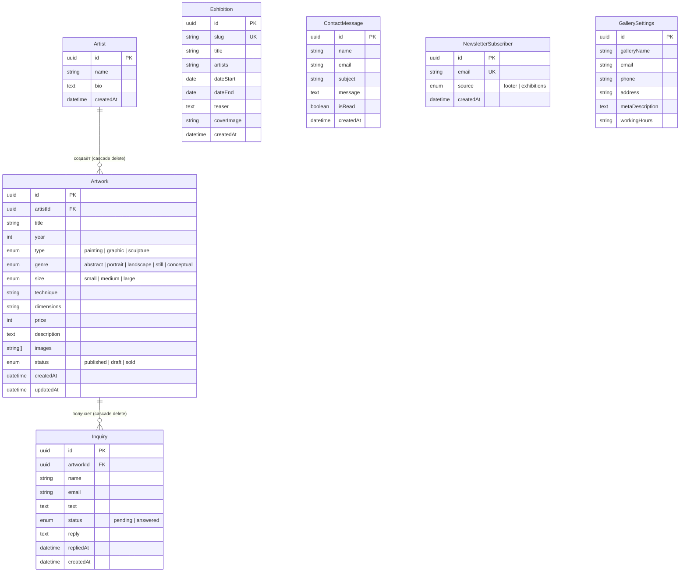

# ERD — Aspect Gallery

```mermaid
erDiagram

    Artist {
        uuid   id          PK
        string name
        text   bio
        datetime createdAt
    }

    Artwork {
        uuid     id          PK
        uuid     artistId    FK
        string   title
        int      year
        enum     type        "painting | graphic | sculpture"
        enum     genre       "abstract | portrait | landscape | still | conceptual"
        enum     size        "small | medium | large"
        string   technique
        string   dimensions
        int      price
        text     description
        string[] images
        enum     status      "published | draft | sold"
        datetime createdAt
        datetime updatedAt
    }

    Inquiry {
        uuid     id          PK
        uuid     artworkId   FK
        string   name
        string   email
        text     text
        enum     status      "pending | answered"
        text     reply
        datetime repliedAt
        datetime createdAt
    }

    Exhibition {
        uuid     id          PK
        string   slug        UK
        string   title
        string   artists
        date     dateStart
        date     dateEnd
        text     teaser
        string   coverImage
        datetime createdAt
    }

    ContactMessage {
        uuid     id          PK
        string   name
        string   email
        string   subject
        text     message
        boolean  isRead
        datetime createdAt
    }

    NewsletterSubscriber {
        uuid     id          PK
        string   email       UK
        enum     source      "footer | exhibitions"
        datetime createdAt
    }

    GallerySettings {
        uuid   id              PK
        string galleryName
        string email
        string phone
        string address
        text   metaDescription
        string workingHours
    }

    Artist     ||--o{ Artwork  : "создаёт (cascade delete)"
    Artwork    ||--o{ Inquiry  : "получает (cascade delete)"
```
